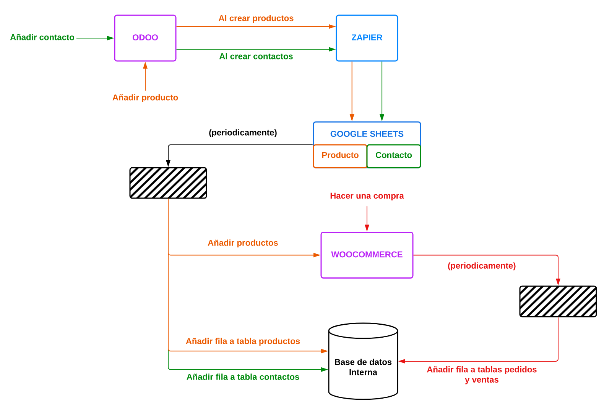

# Integracion Odoo -> WooCommerce
**Estos scripts han sido creados con el fin de facilitar la interconexión entre Odoo ERP/CRM federado y WooCommerce para el desarrollo del proyecto de la asignatura de Sistemas de Información.**

Este es un script desarrollado en Python cuya intención es conectar las bases de datos de Odoo e integrar la creación de productos y contactos con otras plataformas.

## Requisitos
- Una cuenta en Zapier (no tiene que ser premium)
- Dos hojas de Google Sheets __(Desarrollar esto)__
- Una base de datos de MySQL
- Una instalación de WordPress con el plugin WooCommerce
- [Este zap](https://zapier.com/shared/2b376e46616741e7d162774dea368bc35c42bce1) y [este otro zap](https://zapier.com/shared/6a5108217551b0b426c1b81c822ffb8aa52239fc)

## Funcionamiento
Este programa obtiene información de hojas de Google Sheets con los productos y contactos generados por Odoo. Estas son añadidas por medio de triggers en Zapier. Estos triggers se activan cuando se añade un contacto/producto en Odoo.

A continuación, los cambios detectados por Zapier, se añaden a las hojas de la tablas de Google Sheets. Luego este script obtiene periodicamente la información nueva que se haya depositado en estas hojas. 

Cuando encuetra un cambio que no ha sido registrado, en el caso de ser un producto, este lo añadirá a WooCommerce y a una base de datos interna en MySQL. Si se trata de un contacto, el script hara lo mismo, pero a una tabla dedicada exclusivamente a contactos.

### Compras en WooCommerce
Este script también es capaz de detectar las compras que se hayan hecho en el comercio online y las registra en un formato fácil de entender para su posterior análisis haciendo uso de software BI como RapidMiner.

## Diagrama de funcionamiento


## Configuración
Una vez clonado el repositorio, modifique el archivo de configuracion (config.py) con los datos sobre la API key de WooCommerce, la conexión de la base de datos interna y el identificador de las hojas de cálculo de Google Sheets. 

Las claves de la API de WooCommerce se pueden obtener desde la configuración del sitio web de WooCommerce, en la sección de API REST, necesitamos tanto el client key como el client secret. Es importante especificar que la versión de la API es WooCommerce V3 y que se necesita acceso lectura y escritura.

Los identificadores de las hojas de cálculo de Google Sheets se pueden obtener en el enlace de Google Sheets tras compartir la tabla con permisos de Lector a todo el mundo con el enlace.


Este identificador es la cadena de caracteres alfanuméricos que se puede apreciar en el enlace.

También es necesario crear una base de datos MySQL con un usuario y una contraseña e instalar el fichero SQL en la base de datos para que funcione el programa. Una vez hecho esto, es imprescindible especificar los datos para conectarse a la base de datos en el archivo de configuración. 

## Instalación
Para instalar este programa, es necesario tener instalada una versión de Python 3.9 o superior.
A continuación, con los siguientes comandos, crearemos el entorno virtual de Python, el cual es necesario tener para ejecutar los programas:

```sh
sudo apt install python3-venv
python3 -m venv integrador
source integrador/bin/activate
pip3 install -r requirements.txt
```

Una vez instalado este entorno, procedemos a ejecutar el programa como prueba:

```sh
python3 main.py
```

Una vez verificado que el programa no muestra ningún error por pantalla, podemos programar su automatización.

### Automatización de la ejecución
Este programa se ejecutará periodicamente haciendo uso de cron. Cron es una herramienta muy potente en sistemas basados en UNIX la cual permite ejecutar tareas de forma periodica. El programa estará configurado para ejecutarse cada media hora entre las 8:00 y las 21:00. Para modificar el archivo de configuración de cron, es necesario usar el siguiente comando:

```sh
crontab -e
```

Tras seleccionar nuestro editor de preferencia, añadiremos lo siguiente al archivo:

```crontab
PATH=/home/usuario/integracion_odoo_woocommerce/integrador/bin

0,30 * * * * python3 /home/usuario/integracion_odoo_woocommerce/woocommerce_a_db.py
0,30 8-21 * * * python3 /home/usuario/integracion_odoo_woocommerce/main.py
```

Es imprescindible cambiar la ubicación `/home/usuario/integracion_odoo_woocommerce/` en todas las entradas por las ubicaciones correspondientes a nuestra instalación del script.

Una vez hecho eso, podemos probar la ejecución con el siguiente comando

`/bin/sh -c "(PATH=/home/usuario/integracion_odoo_woocommerce/integrador/bin; python3 /home/usuario/integracion_odoo_woocommerce/main.py)"`

Si este no devuelve ningún error es que todo se ha instalado de manera correcta.
